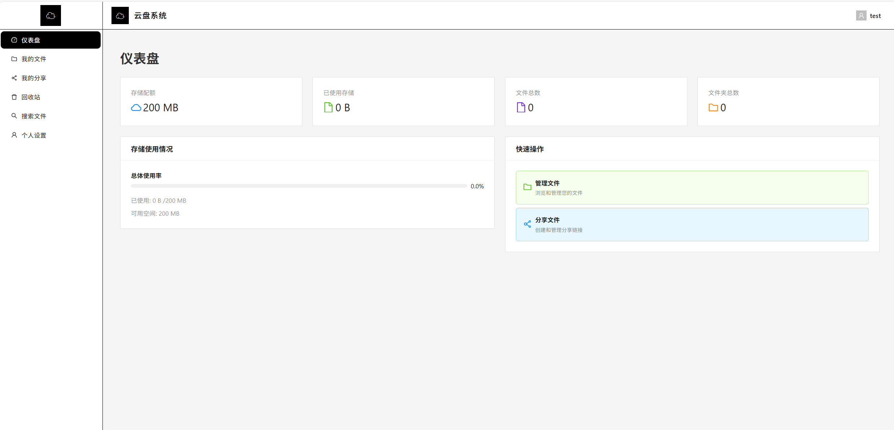

## 导航 / Navigation

- [中文说明（Chinese Guide）](#cn-guide)
- [English Guide](#en-guide)

---

<a id="cn-guide"></a>

## 一、中文说明（Chinese Guide）

### 1. 项目简介

**云盘系统（Cloud Storage System）** 是一个基于 **Django + React + MySQL + OpenStack Swift** 的个人 / 团队云存储项目，支持文件管理、分享、回收站、管理员后台等功能。

### 2. 项目定位（中文）

- **目标用户**：需要自建网盘的个人开发者、小团队、实验室、校园社团等，希望掌控数据而不依赖第三方公有云。
- **使用场景**：
  - 内网文件共享与备份（公司 / 学校 / 宿舍局域网）
  - 个人多设备同步和备份（配合对象存储或本地磁盘）
  - 作为「Django + React + OpenStack Swift」技术组合的学习 / 教学示例
- **产品特点**：前后端分离、部署简单、代码结构清晰，适合二次开发和功能扩展。

### 3. 功能列表

- **文件管理**：上传、下载、重命名、移动、删除、文件夹管理
- **存储后端**：
  - OpenStack Swift 对象存储
  - 本地存储（作为备选或开发环境使用）
- **用户与权限**：注册、登录、个人资料、头像上传、角色（普通用户 / 管理员 / VIP）
- **分享功能**：生成分享链接、设置密码和有效期、外链访问
- **回收站**：软删除、恢复、彻底删除
- **统计与管理**：存储空间统计、VIP 申请与审核、登录记录、在线用户
- **前端体验**：React + Ant Design，支持基础响应式布局

### 4. 界面预览

<div align="center">



</div>

### 5. 技术栈

- **后端**
  - Django 4.2.7
  - Django REST Framework
  - MySQL
  - OpenStack Swift（对象存储）
  - Celery + Redis（异步任务 & 消息队列）

- **前端**
  - React 18
  - Ant Design
  - React Router v6
  - React Query

---

### 5. 本地部署步骤（仅代码，不包含演示数据）

#### 5.1 克隆代码

```bash
git clone https://gitee.com/song-diyang/cloud-storage-system.git
cd cloud-storage-system
```

#### 5.2 后端环境（Django + MySQL）

1）创建虚拟环境并安装依赖：

```bash
python -m venv venv

# Windows
venv\Scripts\activate

# Linux / macOS
source venv/bin/activate

pip install -r requirements.txt
```

2）配置数据库（MySQL）：  
- 默认在 `cloud_storage/settings.py` 中读取环境变量：
  - `DB_NAME`（默认：`cloud_storage`）
  - `DB_USER`（默认：`root`）
  - `DB_PASSWORD`（默认：`3306`）
  - `DB_HOST`（默认：`localhost`）
  - `DB_PORT`（默认：`3306`）

请在 MySQL 中创建对应数据库，并按需修改环境变量或直接修改 `settings.py`。

3）迁移数据库并创建超级用户：

```bash
python manage.py migrate
python manage.py createsuperuser
```

4）启动后端服务：

```bash
python manage.py runserver 0.0.0.0:8000
```

#### 5.3 前端环境（React）

```bash
cd frontend
npm install
npm start
```

前端默认运行在 `http://localhost:3000`，`package.json` 中配置了：

```json
"proxy": "http://localhost:8000"
```

因此前端会自动把 `/api/...` 请求转发到后端。

#### 5.4 访问入口

- 登录页：`http://localhost:3000/login`
- 用户首页 / 文件页：`http://localhost:3000/dashboard`
- 分享访问：`http://localhost:3000/share/:shareCode`
- Django 管理后台：`http://localhost:8000/admin`

---

### 6. OpenStack Swift 部署与连接（详细）

后端通过 `cloud_storage/settings.py` 中的 `SWIFT_CONFIG` 使用 OpenStack Swift。你需要准备好一个可用的 OpenStack 环境，并配置好认证信息。

#### 6.1 前置条件

- 已部署好的 OpenStack（DevStack 或 生产环境）
- 已安装并运行 Swift（Object Storage）服务
- 拥有一个项目（Project / Project）和具备访问 Swift 权限的用户

#### 6.2 在服务器上配置环境变量

在运行 Django 后端的服务器 / 容器中，设置以下环境变量（示例）：

```bash
# Keystone 认证地址（注意 /v3）
export OS_AUTH_URL=http://<YOUR_OPENSTACK_HOST>/identity/v3

# 域配置（默认即可，不清楚就用 default）
export OS_USER_DOMAIN_ID=default
export OS_PROJECT_DOMAIN_ID=default

# 认证用户信息
export OS_USERNAME=admin
export OS_PASSWORD=your_password
export OS_PROJECT_NAME=admin

# 区域（和你 OpenStack 配置一致）
export OS_REGION_NAME=RegionOne

# 可选：自签名证书的 CA 文件路径
export OS_CACERT=
```

`settings.py` 中的 `SWIFT_CONFIG` 会读取这些环境变量，无需修改代码：

```python
SWIFT_CONFIG = {
    'auth_version': '3',
    'auth_url': os.getenv('OS_AUTH_URL', 'http://.../identity/v3'),
    'username': os.getenv('OS_USERNAME', 'admin'),
    'password': os.getenv('OS_PASSWORD', 'devstack123'),
    'project_name': os.getenv('OS_PROJECT_NAME', 'admin'),
    'project_domain_id': os.getenv('OS_PROJECT_DOMAIN_ID', 'default'),
    'user_domain_id': os.getenv('OS_USER_DOMAIN_ID', 'default'),
    'region_name': os.getenv('OS_REGION_NAME', 'RegionOne'),
    'cacert': os.getenv('OS_CACERT', None),
}
```

#### 6.3 使用 python-swiftclient 测试连接（可选）

在激活虚拟环境后执行：

```bash
swift stat
swift list
```

- `swift stat`：查看当前账号信息
- `swift list`：列出所有容器

如果命令返回正常数据，说明 Swift 认证配置正确。

#### 6.4 容器与存储策略

- 项目会为用户上传的文件创建对象，容器命名可以在代码中统一配置（例如：按用户分容器或统一容器 + 目录）。
- 建议在 OpenStack 端开启：版本控制、生命周期（自动过期）、配额限制等策略，以便更好地控制成本和安全。

#### 6.5 生产环境建议

- 使用内网 / 专用子网访问 Swift，避免直接暴露存储节点到公网。
- 对外下载链接建议走 Django + Nginx 反向代理，并做限速、鉴权、日志记录。
- 对 Swift 操作添加监控（请求失败率、响应时间、存储容量告警等）。

---

### 7. 目录结构（简要概览）

```text
cloud-storage-system/
├─ cloud_storage/        # Django 项目配置
├─ accounts/             # 用户 / 角色 / VIP / 登录记录等
├─ files/                # 文件 / 文件夹 / 分享 / 回收站等
├─ frontend/             # React 前端源码
├─ requirements.txt      # 后端依赖
└─ manage.py             # Django 管理脚本
```

---

### 8. 许可证

本项目采用 **MIT License**，可用于学习、实验和二次开发。

---

## 赞助 / Sponsor

如果您觉得这个项目对您有帮助，欢迎赞助支持！

<div align="center">

### WeChat Pay / 微信支付


### Alipay / 支付宝


</div>

---

<a id="en-guide"></a>

## II. English Guide

### 1. Overview

**Cloud Storage System** is a personal / team cloud drive project built with **Django + React + MySQL + OpenStack Swift**.  
It supports file management, sharing, recycle bin, and an admin dashboard.

### 2. Positioning & Use Cases

- **Target users**: individual developers, small teams, labs, and student groups who want a self-hosted cloud drive and full control over their data.
- **Typical scenarios**:
  - Intranet file sharing and backup (office / school / dorm LAN)
  - Personal multi-device backup with object storage or local disks
  - A reference implementation for learning / teaching the stack “Django + React + OpenStack Swift”
- **Key traits**: clean architecture, simple deployment, and easy to extend for your own business needs.

### 3. Features

- **File Management**: upload, download, rename, move, delete, folder management
- **Storage Backends**:
  - OpenStack Swift object storage
  - Local storage (as backup or for development)
- **Users & Roles**: registration, login, profile, avatar upload, roles (user / admin / VIP)
- **Sharing**: share links, password protection, expiration, public access
- **Recycle Bin**: soft delete, restore, permanent delete
- **Statistics & Admin**: storage usage, VIP applications, login records, online users
- **Frontend**: React + Ant Design, basic responsive layout

### 4. Interface Preview

<div align="center">


</div>

### 5. Tech Stack

- **Backend**
  - Django 4.2.7, Django REST Framework
  - MySQL
  - OpenStack Swift
  - Celery + Redis

- **Frontend**
  - React 18
  - Ant Design
  - React Router v6
  - React Query

---

### 5. Local Setup

#### 5.1 Clone the project

```bash
git clone https://gitee.com/song-diyang/cloud-storage-system.git
cd cloud-storage-system
```

#### 5.2 Backend (Django + MySQL)

1) Create virtual env and install dependencies:

```bash
python -m venv venv

# Windows
venv\Scripts\activate

# Linux / macOS
source venv/bin/activate

pip install -r requirements.txt
```

2) Configure MySQL:  
Database settings are read from environment variables in `cloud_storage/settings.py`:

- `DB_NAME` (default: `cloud_storage`)
- `DB_USER` (default: `root`)
- `DB_PASSWORD` (default: `3306`)
- `DB_HOST` (default: `localhost`)
- `DB_PORT` (default: `3306`)

Create the database in MySQL and adjust env vars or `settings.py` if needed.

3) Migrate and create superuser:

```bash
python manage.py migrate
python manage.py createsuperuser
```

4) Run backend:

```bash
python manage.py runserver 0.0.0.0:8000
```

#### 5.3 Frontend (React)

```bash
cd frontend
npm install
npm start
```

The frontend runs at `http://localhost:3000` and proxies API requests to `http://localhost:8000` via `package.json`:

```json
"proxy": "http://localhost:8000"
```

#### 5.4 Entry Points

- Login: `http://localhost:3000/login`
- User dashboard: `http://localhost:3000/dashboard`
- Share view: `http://localhost:3000/share/:shareCode`
- Django admin: `http://localhost:8000/admin`

---

### 6. OpenStack Swift Setup & Integration

The backend uses the `SWIFT_CONFIG` section in `cloud_storage/settings.py` and environment variables to connect to Swift.

#### 6.1 Prerequisites

- A running OpenStack environment (DevStack or production)
- Swift (Object Storage) service installed and running
- A project and a user with permission to access Swift

#### 6.2 Environment Variables

Set the following env vars on the server where Django runs:

```bash
# Keystone endpoint (make sure /v3 is used)
export OS_AUTH_URL=http://<YOUR_OPENSTACK_HOST>/identity/v3

# Domains
export OS_USER_DOMAIN_ID=default
export OS_PROJECT_DOMAIN_ID=default

# Credentials
export OS_USERNAME=admin
export OS_PASSWORD=your_password
export OS_PROJECT_NAME=admin

# Region
export OS_REGION_NAME=RegionOne

# Optional CA cert
export OS_CACERT=
```

These will be read by:

```python
SWIFT_CONFIG = {
    'auth_version': '3',
    'auth_url': os.getenv('OS_AUTH_URL', 'http://.../identity/v3'),
    'username': os.getenv('OS_USERNAME', 'admin'),
    'password': os.getenv('OS_PASSWORD', 'devstack123'),
    'project_name': os.getenv('OS_PROJECT_NAME', 'admin'),
    'project_domain_id': os.getenv('OS_PROJECT_DOMAIN_ID', 'default'),
    'user_domain_id': os.getenv('OS_USER_DOMAIN_ID', 'default'),
    'region_name': os.getenv('OS_REGION_NAME', 'RegionOne'),
    'cacert': os.getenv('OS_CACERT', None),
}
```

#### 6.3 Test Swift Connection (optional)

With `python-swiftclient` installed, run:

```bash
swift stat
swift list
```

If both commands succeed, your Swift authentication is correctly configured.

#### 6.4 Containers & Strategy

- The project creates objects for uploaded files; you can use per-user containers or a shared container with folder prefixes.
- On the OpenStack side, consider enabling lifecycle policies, versioning, and quotas.

#### 6.5 Production Recommendations

- Access Swift via internal networks or dedicated subnets.
- Serve downloads through Django + Nginx (reverse proxy), with throttling, auth, and logging.
- Add monitoring and alerts for Swift operations and capacity.

---

### 7. License

This project is released under the **MIT License**.

---

## Sponsor / 赞助

If you find this project helpful, you're welcome to support us!

<div align="center">

### WeChat Pay / 微信支付


### Alipay / 支付宝


</div>

---

## Contributors / 贡献者

感谢以下贡献者为项目做出的努力：

<div align="center">

<!-- 用法:  -->

[](https://gitee.com/song-diyang)

</div>
